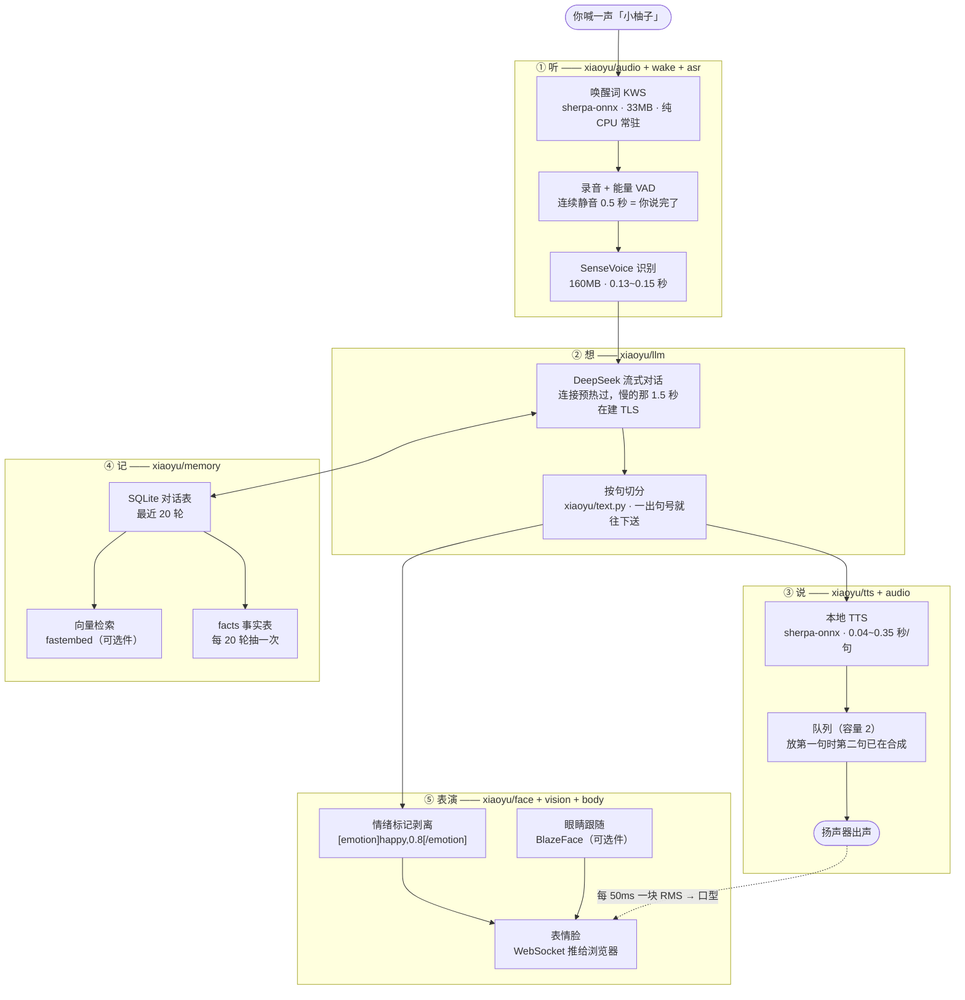
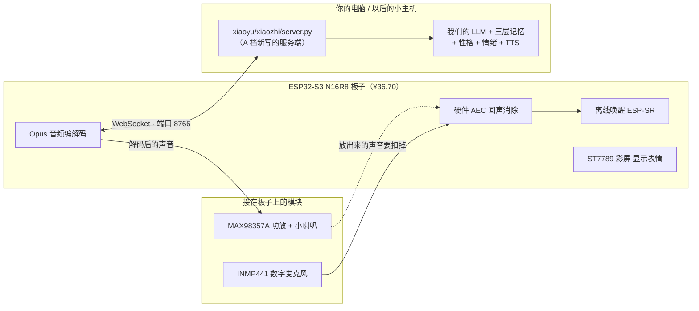

# 小柚子是怎么实现的

> 这一份是写给你自己看的：**它到底怎么跑起来、那些功能是怎么做到的、
> 我买的硬件有什么用、接下来往哪走。**
> 不用看代码，读完这一份你就能给别人讲清楚它是个什么东西。
>
> 配套文档：
> - [`../HANDOFF.md`](../HANDOFF.md) —— 进度 + 已经踩过的坑（这份给 AI 看）
> - [`总方案_v3_从现在开始.md`](总方案_v3_从现在开始.md) —— 路线图
> - [`xiaozhi拆解.md`](xiaozhi拆解.md) —— 板子和我们的分工边界
> - [`A档购物清单.md`](A档购物清单.md) —— 买了什么、接线表
> - [`到货当天_手把手.md`](到货当天_手把手.md) —— 板子到了怎么接、怎么刷
>
> 基线：**504 个测试全绿**（unittest 与 pytest 数字一致，2026-09-19）。

---

## 0. 30 秒版

**小柚子是一台"会听、会想、会说、还会记"的桌面陪伴机器人。**

现在它跑在**你的电脑上** —— 用电脑的麦克风、电脑的喇叭、浏览器里那张脸。

它的核心不是"一个大程序"，而是**一条流水线**：

    你喊名字  →  它醒  →  你说一句  →  它听懂  →  它想  →  它开口  →  它记住

每一步都有一个专门的模块负责，模块之间只通过"上下料"打交道。
所以哪一步慢、哪一步想换，换那一个文件就够了 —— 这是整个项目最重要的一个设计决定。
（细节见 §2 每一节的"文件"一栏。）

**A 档买的那堆硬件，是要给它换一副身体**：把"耳朵和嘴巴"搬到一块 ¥37 的
ESP32-S3 小板上，让它以后**离开电脑**也能用。
脑子（大模型、三层记忆、性格、情绪）还是我们自己的 Python 代码，一行都不交出去。

---

## 1. 一张图看全貌



一句话读这张图：**声音从上面进、从下面出，中间穿过了"想"和"记"两层；
脸是旁挂的观众，它只是把已经发生的事演出来。**

---

## 2. 它是怎么实现的 —— 一条流水线，逐段拆开

### 2.1 唤醒：喊一声它就醒

**怎么做到的**：跑一个专门的"关键词检测"模型（sherpa-onnx KWS），麦克风一直开着，
它只干一件事 —— 判断"刚才这段声音里有没有出现预设的音素序列"。
命中就放行，让主流程开始录音。

| 项 | 值 |
|---|---|
| 文件 | `xiaoyu/wake/kws.py`（跑模型）、`xiaoyu/wake/models.py`（选型与校验，纯逻辑） |
| 模型 | 33MB，纯 CPU 常驻，几乎不吃资源 |
| 为什么选它 | 免费、离线、不用注册账号、**改词不用重新训练模型** |
| 唤醒词写在哪 | `config/keywords.txt` |

**这里有一个非常容易踩的坑，已经写进注释了**：这个词表是**音素级**的，不能写汉字。

    错：  小柚子 :2.5 #0.5 @小柚子
    对：  x iǎo y òu z i :2.5 #0.5 @小柚子

写汉字会让 sherpa-onnx 在 C++ 层直接报错退出，**连 Python 异常都抓不到**。
所以别手写拼音，用脚本生成：

    python scripts\make_keywords.py 小柚子 --write

格式是 `音素序列 :阈值 #增强 @显示名`，阈值越大越难唤醒（越不容易误触发）。

**误唤醒有数**：`python -m xiaoyu --wake-report` 会扫 `logs/` 下的唤醒日志，
按天统计唤醒次数，并**把凌晨 0~6 点单独拎出来**（那个点没人说话，响了就是误唤醒）。
统计逻辑在 `xiaoyu/app.py` 的 `count_wake_events`。

### 2.2 听：录音 + 断句 + 转文字

**怎么做到的**：三层，一层一层往下剥。

1. **录音** —— `xiaoyu/audio/recorder.py`。麦克风开着的那些帧，先算能量大小。
2. **断句（VAD）** —— 用的是最朴素的**能量检测**：连续静音超过 `silence_seconds = 0.5` 秒
   就算"你说完了"。够用，且零额外依赖。想升级可以换 silero-vad，但那要引依赖，暂时不值。
3. **语音转文字** —— `xiaoyu/asr/recognizer.py`，模型是 **SenseVoice**。
   选它的理由：中文准确率高、**纯 CPU 就能实时（实测 0.13~0.15 秒）**、离线、模型只有 160MB。

**这一层有个实测踩出来的坑，值得你知道**（`xiaoyu/audio/devices.py`）：

- **坑 1 · 系统默认输出不一定是喇叭。** 实测默认输出是**显示器的 HDMI 音频**，
  声音全进了显示器，笔记本扬声器一点动静都没有，**而日志看起来一切正常**。
- **坑 2 · 设备编号会漂移。** 同一台机器、同一次开机，两次运行之间 `[3]` 和 `[4]`
  互换了（扬声器 ↔ 显示器的 HDMI 音频）。原因是 PortAudio 的枚举顺序不是固定的。

结论：**配设备按名字配，别按编号配**（`.env` 里 `XIAOYU_MIC_DEVICE_NAME` 那一套）。
编号只当备用手段。这个模块还刻意**不 import sounddevice**，所以 `match_devices()`
是纯函数，没装声卡驱动也能跑测试。

### 2.3 想：大模型这层，以及首句为什么能快

**怎么做到的**：`xiaoyu/llm/client.py`，接了 DeepSeek 的**流式**接口。五个关键设计：

1. **流式 + 按句切分。** 回答一出句号就立刻送去合成，**不等整段生成完**。
   切分逻辑在 `xiaoyu/text.py`（纯文本工具，零依赖，可单独测试）。
   这就是首句能快的原因 —— 你听到的是第一句，不是最后一句。
2. **性格写在 `config/persona.md` 里。** 改人格不用动一行代码。
3. **启动时把上次的对话从 SQLite 读回来**（这一步叫 4a），
   并且告诉模型"现在几点、上次聊天是多久以前"。
   也就是说 —— **现在关掉程序再开，它还记得你。**
4. **每聊够 20 轮，后台把"关于主人的事实"抽出来存进 `facts` 表**（4b）。
   判重的时候把已有事实**连 id 一起**喂给模型，让它直接说"这条跟 id=3 重复" ——
   比拿两段文字做字符串比对可靠得多。
5. **连接预热。** 这一条最反直觉，也最值钱：**慢的那 1.5 秒全在建 TCP + TLS，
   不在"想得久"。**

**实测数字（这是"先量后改"的凭据，不是感觉）**：

| 环节 | 数字 |
|---|---|
| DeepSeek 首请求 · 冷连接 | 1.99 ~ 2.29 秒 |
| DeepSeek 首请求 · 热连接 | 0.53 ~ 0.65 秒（预热后到 0.41） |
| 上下文从 0 轮涨到 40 轮 | 耗时几乎不变 —— 慢的真的不在上下文长度 |

### 2.4 说：为什么把 edge-tts 换掉了

**怎么做到的**：`xiaoyu/tts/engine.py`（把一句话变成一段波形）+ `xiaoyu/tts/synthesizer.py`
（什么时候说、怎么连着说）。

**换引擎这件事是拿数字换的**，不是口味问题：

| 引擎 | 首块音频耗时 | 失败率 |
|---|---|---|
| edge-tts（微软云） | 0.88 / 1.13 / 3.17 / 3.23 / 5.11 / 9.33 / 10.10 / 11.76 秒 | 10 次里 **2 次直接失败** |
| 本地 sherpa-onnx | **0.04 ~ 0.35 秒/句** | 不联网，不会失败 |

病根是 **edge-tts 每合成都去连一次微软的服务器，每句话重新握一次手** ——
回你三句话，就是抽三次奖。这是"反应慢"的主因，比大模型慢得多。

代价是本地音色不如晓晓自然。所以 **edge-tts 没被删掉**，只是从"唯一选择"降级成了
可切换的"高音质模式"（`tts.engine = "edge"`）。

**第二个关键设计：合成和播放重叠。**
旧版是「合成 → 播放 → 合成 → 播放」串行的，每句话的合成时间都白白加到总时长上。
现在**合成在主线程、播放在另一个线程**，中间用一个**容量只有 2** 的队列连着：
放第一句的时候，第二句已经在合成了。

> 容量故意只有 2 —— 攒太多的话，你中途打断它，还得等一堆没用的音频放完。

**第三个设计：播放改成分块写。**
`xiaoyu/audio/player.py` 在 S5 把 `sd.play` 换成了 `OutputStream` 分块写，两个目的：

1. 每 50ms 一块算 RMS 推给表情脸当**口型**（`mouth.level`）；
2. 块与块之间都能响应 `stop()` —— **触屏打断要能立刻停**，不能等整句放完
   （旧版 `sd.play` 中途停不下来）。

**接口故意做得很小，就一个方法**：

    engine.synthesize("你好") -> Speech(samples, samplerate)

以后想换 Kokoro、GPT-SoVITS 克隆音色，只要再写一个类，**别的代码一行都不用动**。
### 2.5 记：三层记忆，一层比一层"深"

这是**我们比小智官方强、而且绝不能换掉的那部分**。三层的差别在于"记得多久、记得多深"：

| 层 | 记什么 | 存在哪 | 什么时候用 |
|---|---|---|---|
| 第一层 · 最近 N 轮 | 刚才聊了啥 | SQLite `messages` 表 | 每次都带进上下文（`max_history = 20`） |
| 第二层 · 事实 | "主人不吃香菜"这种 | SQLite `facts` 表 | 每 20 轮抽一次，永久留着 |
| 第三层 · 向量检索 | 很久以前说过的原话 | `vectors` 表 + 向量 | 按**语义**捞相关的几条（`top_k = 3`） |

- 代码在 `xiaoyu/memory/store.py`（SQLite）和 `xiaoyu/memory/vectors.py`（向量）。
- 第一层其实 S2 就有了 —— **数据一直都在库里，以前只是没人读回去**。4a 做的就是"读回来"。
- 第三层用的是 `fastembed + BAAI/bge-small-zh-v1.5`，**刻意不引入 torch**（太重）。
  首次编码会从 HuggingFace 下 90MB 模型，只下一次，之后走本地缓存。
- **第三层是可选的**：`fastembed` 装不上，检索就自动退回"最近 N 条"，
  记忆主流程一行不受影响。这是全项目统一的"**可选件静默降级**"原则
  （表情脸、眼睛跟随、向量检索，都是这一套）。

### 2.6 性格

一句人话：**人格是一份可编辑的 Markdown 文件，不是代码。**

- 文件：`config/persona.md`，另外两套模板在 `config/persona_examples.md`。
- 里面除了"你是谁"，还写着**说话规矩**，而且那些规矩是踩出来的，不是写着玩的：

      一次最多两句话，每句不超过 25 个字
      不用"首先/其次/综上所述"这类书面语
      不用 emoji，不要列表，因为你是在"说话"不是在"写文档"
      被问到不知道的事，直接说不知道，不要编

  最后一条尤其重要：**这决定了它听起来像朋友，还是像客服。**

### 2.7 情绪：不用多花一毫秒，就知道它是什么心情

**怎么做到的**（`xiaoyu/llm/emotion.py`）：让模型在**每轮回复的最后**输出一个标记：

    今天我也好开心呀！[emotion]happy,0.8[/emotion]

为什么放在结尾？三个理由，都是算过账的：

- **零额外延迟、零额外调用** —— 标记跟着流式正文一起到，**不占首句时间**；
- **正文和情绪同一次生成**，语义必然一致（不会出现"嘴上说开心、表情写难过"）；
- **标记在结尾**，正文先切句先出声，情绪解析完时话差不多也快说完了，
  **脸刚好来得及变表情**。

实现细节：剥离是**增量**的（流式场景必须这样）—— 任何时候出现完整标记就摘掉；
**结尾残缺的半个标记**（`[emotion]hap…`）**先按住不显示**，等它长完整或者流结束。
解析不出来一律 `neutral` —— **情绪是表演，不是主流程，绝不能带崩对话。**

五个合法情绪是：`happy / sad / angry / surprised / neutral`。

### 2.8 表情脸：主控和脸是两个进程，靠一份契约说话

**怎么做到的**：

1. **先定协议**（`xiaoyu/face/protocol.py`）—— 这是**唯一的契约**，主控和脸都只认它。
   事件（主控 → 脸，JSON 文本帧）：

       {"type": "state",   "state": "idle"}         # idle/listening/thinking/speaking/error
       {"type": "mouth",   "level": 0.37}           # 音量包络，约 50ms 一帧，口型跟随
       {"type": "caption", "text": "今天也要加油"}   # 字幕
       {"type": "gaze",    "x": -0.4, "y": 0.2}     # 眼睛跟随
       {"type": "emotion", "mood": "happy", "intensity": 0.8}
       {"type": "tick"}                             # 心跳，闲置时的空包

   命令（脸 → 主控）：`{"type": "interrupt"}` —— **点一下脸就打断它说话。**

2. **服务在独立守护线程里**（`xiaoyu/face/server.py`），自带一个 asyncio 事件循环。
   为什么不并进主循环？因为主控的串行循环是**阻塞式**的 —— 不为一张脸重写主循环。
   广播用 `run_coroutine_threadsafe` 跨线程投递：**脸卡了、网抖了，最坏是几条消息没送到，
   主控的声音一秒都不许多等。**

3. **网页由主控自己发**（`xiaoyu/face/static.py`）。以前这张脸只能在笔记本上双击文件打开，
   平板做不到，当时是临时起 `python -m http.server 8080`（重启就没了）。
   现在和 WebSocket **同一个端口**（`8765`），平板只要打开 `http://<主机IP>:8765/` 就是脸 ——
   页面里 `location.hostname` 天然就是主机地址，**配对零操作**。

4. **终端里还有个字符画分身**（`xiaoyu/face/console.py`）。调试时人盯着终端，
   为看一眼状态再切浏览器很烦。它把**同一批事件**翻译成几行字符画打进日志流。
   注意口型不是 50ms 实时刷（会刷屏刷爆），而是把**一整句说话期间**的音量压成
   一条 8 字符 sparkline，句子说完随字幕一起打出来。

**安全边界**（v3 §3.1）：只在家里 WiFi 用，**不映射公网**；连接必须带 token
（`?token=xiaoyu`），防局域网里别的设备误连。`websockets` 这个包只在 `start()` 时才
import —— **没装它只是脸不启用，语音功能一行不受影响。**

### 2.9 眼睛跟随（S6a）：它盯着你看

**怎么做到的**，分成两半，一半能测、一半碰硬件：

- `xiaoyu/vision/gaze.py` —— **纯函数**，不碰摄像头、不 import 任何重依赖。
  输入人鼻尖在画面里的位置，输出"该往屏幕哪边看"，两个值夹在 `[-1, 1]`。
  纯函数就能单测 —— 这是把数学钉死的办法。
- `xiaoyu/vision/tracker.py` —— 守护线程，摄像头取流 + BlazeFace 检测 + 广播。
  **只在待机/听话时取帧** —— 说话时眼睛忙、不抢 CPU，摄像头也没必要一直亮着
  （隐私 + 功耗双赢）。检测不到人脸就闭嘴不发，脸那侧有 500ms 超时，会自动回待机游荡。

**这里有过一次返工，根因记在 `gaze.py` 的注释里，别删**：
用户报的症状是「**人往右移，眼睛却往左看**」。原因是摄像头拍的是**未镜像**画面，
而你往自己右边动，在画面里你出现在左边；可脸是朝着你画的 ——
两边各反一次、互相抵消，于是代码里必须再反一次才对。原来注释写的
"人在画面左边 → 眼睛往左看"，是把"画面左边"当成了"屏幕左边"，病根就在这一句。

顺带一个反例：**上下不存在镜像**（你抬头，画面里你也偏上），所以 y 不反号。

### 2.10 身体接口层（S7 准备）：现在只有假舵机，但缝已经留好了

**为什么硬件还没买就先做这个**：行为代码（对话、表情、视线）**不该 import 具体驱动**。
真驱动买回来那天，**换身体 = 加一个 backend 文件**，而不是回头改对话逻辑。

- `xiaoyu/body/servo.py` —— `ServoBackend` 接口只有两个方法：`set_angle(degrees)`、`close()`。
  行为代码只认这个形状，**不认识 pyserial、不认识 PWM 引脚号**。
  真实现可以是 ESP32 上的串口/HTTP 服务、树莓派的 GPIO PWM、或者现成的舵机模块。
- `xiaoyu/body/head.py` —— 把 gaze 翻译成"头该转多少度"（`pan_range = 30°`、`tilt_range = 15°`）。

**一条规矩，别破**：硬件装反了**不要改 `head.py` 里的正负号**，走
`HeadLook(invert_pan=...)` / 配置项（`XIAOYU_BODY_INVERT_PAN`）。
理由就是 §2.9 那次返工 —— **镜像只能有一个出处**，散在代码里最后谁也说不清反了几次。

屏幕 / 麦克风 / 喇叭的抽象**故意还没抽** —— 现在抽就是凭空猜接口，不如等真硬件定下来。

### 2.11 常驻自愈（S5.5）：崩了会自己爬起来

**怎么做到的**：`scripts/guardian.py` 负责守护，`scripts/install_autostart.py` 负责开机自启，
`xiaoyu/lifecycle.py` 负责**判定"什么才算崩了"**。

"崩溃只能有一个答案"，所以判定**只写在这一份里**，写日志的和读仪表盘的共用。

**这里也有一个实测踩出来的坑（2026-09-19 搬家断电那次）**：
断电后开机自启一切正常，可仪表盘却报「本体中途崩溃次数：2」。查下来真相是 ——
系统关机时把本体终结了（退出码 `0x40010004`），守护 5 秒后又去重启，
而那个瞬间机器已经在关机流程里，python 连 DLL 都初始化不了（`0xC0000142`）。
**两条都是"关机"的正常现象，一条都不是崩溃。**
修法有两处：判定要按**退出码**来；更要**在守护那一侧就拦住** ——
关机时安静收工，别再制造假的"崩溃"。

### 2.12 两条铁律（破了就出鬼）

1. **半双工：说话时必须闭麦。**
   外放喇叭 + 同时开麦 = **它会听到自己的声音、自己唤醒自己**。
   所以主循环是**严格串行**的：听唤醒词时开麦，说话时就关麦。
   S5 已经实现了"触屏打断"（点脸即停，走 WebSocket，不涉及回声）；
   **语音打断**（说话时喊唤醒词）要先解决回声问题，那是以后的事。
2. **首句 2.5 秒内必须出声。**
   所以按句切分流式，**别绕过 `xiaoyu/text.py` 的切分逻辑**。
   一旦有人图省事改成"等整段生成完再合成"，首句会掉到 5 秒开外，整个体验就垮了。

---

## 3. 我买的硬件，具体是干什么的

### 3.1 先说结论：这堆东西不是"电脑"，是"耳朵和嘴巴"

现在的样子是：**电脑当身体**（用电脑的麦、电脑的喇叭、浏览器里那张脸）。

A 档要做的事，是把**耳朵和嘴巴**搬出去，装到一块巴掌大的板子上：



**脑子一行都不搬。** 板子负责收音、唤醒、放音、显示；谁来思考、说什么、记不记得你，
全部由我们的 Python 决定。这就是 `docs/xiaozhi拆解.md` 说的：
**它给"身体 + 协议"，我们做"大脑 + 性格"。**

### 3.2 逐件对照表

| 硬件 | 花了多少 | 它到底干什么 | 少了它会怎样 |
|---|---|---|---|
| **ESP32-S3 开发板（N16R8）** | ¥36.70 | 整个设备的主控。跑离线唤醒、硬件 AEC、Opus 编解码、驱动屏幕 | **它是唯一不可替代的** —— 其他件都是它的附件 |
| **INMP441 数字麦克风** | ¥12.18 | 把声音变成数字信号（I2S）喂给板子 | 板子没耳朵，喊它听不见 |
| **MAX98357A 数字功放** | 拼多多 5 件之一 | 把板子的数字音频放大，推得动喇叭 | 有嘴说不出声 |
| **8Ω 2W 小喇叭** | 同上 | 出声 | 同上 |
| **ST7789 彩屏 240x320** | 同上 | 显示表情 / 状态 | 没脸，只剩声音（**所以没买 OLED** —— 单色屏显示不了彩色表情包） |
| **面包板 + 杜邦线** | 同上 | 把它们连起来，不焊 | 接不上 |
| **Type-C 数据线 + 5V 充电头** | 家里有 | 供电 + 刷固件 | 不亮 |

总计 **¥95.15**（7 件，全部包邮）。
到货时间：板子 **9-21**，麦 **9-22**，其余拼多多已打包。

### 3.3 为什么板子**必须**是 N16R8

这一条是**买错就刷不上固件**的硬指标，来源是上游仓库的 `sdkconfig.defaults`：

- `FLASHSIZE_16MB` —— **16MB Flash**（N16 的 16）
- `SPIRAM_MODE_OCT` —— **八线（Octal）PSRAM**（R8 的 8）

普通板子是 4MB Flash + 四线 PSRAM，**固件比 Flash 还大，直接烧不进去**，
或者烧进去一跑就崩。所以买板子时"ESP32-S3 N16R8"这四个字符一个都不能少。

### 3.4 澄清一个看起来自相矛盾的地方

`docs/总方案_v3_从现在开始.md` §5.5 写着：**"别买 ESP32-S3 之类「AI 模块」做本体"**。
那为什么现在又买了？

因为**"做本体"和"做耳朵嘴巴"是两件完全不同的事**：

- **当本体**（❌ 不干）：指望板子自己跑 ASR + LLM + TTS。它跑不动 SenseVoice，
  折腾到最后你会把它降级成"点亮一个 LED"，然后吃灰。这个判断没变。
- **当耳朵嘴巴**（✅ 在干）：板子只负责收音、唤醒、放音、显示，
  **思考全在我们这边的电脑上**。板子越"笨"越好，因为它干的全是它擅长的活。

顺带一提：这块板子还**白送**两样我们现在没有的东西 ——
**设备端的离线唤醒**（省掉电脑端那个常驻的 KWS 进程）和 **硬件 AEC 回声消除**
（这是将来做"说话时打断它"的前置条件，纯软件方案很难做好）。

### 3.5 板子和现有代码的关系

板子到了以后，**现有的功能一行都不会变**，我们是在旁边**加一层**：

```
现在：  麦克风 → KWS → VAD → ASR → LLM → TTS → 喇叭          （全在电脑上）
以后：  ESP32 板子（麦 + KWS + AEC）→ WebSocket → 我们的服务端 → ESP32 板子（喇叭 + 屏）
                                        └─ 复用同一套 LLM / 记忆 / 性格 / TTS
```

服务端已经开工了，就是 `xiaoyu/xiaozhi/` 那四个文件。
**这一批全部离线写完并测过，一块板子都不需要** —— 因为协议是有文档的，
解析层和状态机都能用"假客户端"跑通（见 §4.1）。
---

## 4. 后续迭代方向

### 4.0 现在到底走到哪一步了

| 阶段 | 是什么 | 状态 |
|---|---|---|
| S0 | 音频自检（能录能放） | ✅ 真机跑通 |
| S1 | 能听会说（识别 + 合成） | ✅ 真人验证通过 |
| S2 | 有脑子（DeepSeek 流式对话） | ✅ 首句出声 0.6 秒 |
| S3 | 唤醒词（喊一声就醒） | ✅ 真人验证通过 |
| S4 | 性格 + 三层记忆 | ✅ 4a / 4b 真人验证；4c 向量检索已完成 |
| S5 | 表情脸 + 触屏打断 | ✅ 第一版真人验证；平板端已完成待验收；Live2D 换皮未开始 |
| S5.5 | 常驻自愈 | 🟡 代码完成、断电恢复已实测，**待跑满一周验收窗口** |
| S6a | 眼睛跟随 | 🟡 代码完成、冒烟通过，**待真人验收** |
| **A 档** | **给它的身体（ESP32-S3）** | **🟢 服务端第一批 5 件已离线写完并测试通过；硬件 9-21 到** |
| S6 | 离开电脑 / 完整版 | ⬜ 未开始 |

**一句话**：**"它"其实已经做完了 —— 现在缺的只是"它住在哪"。**

### 4.1 短期：A 档，让它长出手脚

**已经做完的（不用板子，纯离线）** —— `xiaoyu/xiaozhi/` 四个文件：

| 文件 | 干什么 | 测试 |
|---|---|---|
| `tests/fixtures/xiaozhi/` | 22 个真实 JSON 样本，逐字抄自上游协议文档 | — |
| `xiaoyu/xiaozhi/protocol.py` | 解析设备 `hello`、构造我们的 `hello`、判定二进制(Opus)/文本(JSON)帧 | 55 |
| `xiaoyu/xiaozhi/session.py` | 会话状态机：`connecting → handshaking → listening → speaking → closed` | 54 |
| `xiaoyu/xiaozhi/audio_codec.py` | Opus 编解码的**接口 + 假实现**（真依赖留白） | 63 |
| `xiaoyu/xiaozhi/server.py` | 最小服务端：**能连上、能收发、能优雅收工** | 23 |

设计原则跟 §2.10 的身体接口层是**同一套**：接口先定，行为代码不认具体库。
所以"真 Opus 依赖"只是换一个实现类的事。

**板子到了以后，按这个顺序做（一步只验一件事）**：

1. **刷固件 + 配网**（不碰我们的代码）。验收：喊「你好小智」能用官方云应答 ——
   这一步只验硬件是好的。
2. **告诉板子"往哪连"**。⚠️ 这里有个**容易漏掉的中间层**，也是这轮才核实出来的：
   板子**不是**直接连 WebSocket，而是先读一个「OTA 地址」、发一次 HTTP 请求，
   服务器回 `{"websocket": {"url": "...", "token": "..."}}`，板子存进 NVS，
   **然后才去连 WebSocket**。所以我们的服务端**要多一个 HTTP 接口**，
   光写 WebSocket，板子根本不知道往哪连。
   （出处：`main/Kconfig.projbuild`、`main/ota.cc`、`main/protocols/websocket_protocol.cc`）
3. **接真网络层**：把 `FakeTransport` 换成真的 `websockets`，跑通"能连上、能收发"。
4. **接真 Opus 编解码**：装依赖，补最小单测。

**第二批（这次不做，等上面通了再开）**：
把我们的 `llm/client.py` + `memory/*` + `tts/*` 接到 `xiaozhi/server.py` 上 →
端到端跑通 → 能打断 → **最后用一个开关接进 `app.py`（默认关）**。
到那天的验收标准是那句老话：

> **喊「小柚子」→ 它用我们的记忆和性格回答 → 说到一半能打断。**

### 4.2 中期：S6，离开电脑

目标形态说清楚：**不能动，但要离开电脑** —— 一个放在桌上、插电就活、
有自己的脸和声音的小机器人。

| 里程碑 | 做什么 | 验收 |
|---|---|---|
| M1 | 笔记本常驻 7×24（S5.5） | 连续跑一周不重启、拔插设备能自愈 |
| M2 | 小主机到手，**先当第二台开发机** | 跑 `bench_latency.py --no-llm` 出分，ASR/TTS < 0.5 秒才继续 |
| M3 | 整体迁移 | 拷代码 → 装依赖 → 改两个设备名 → 跑通，行为和笔记本一致 |
| M4 | 外壳 / 支架 / 点头舵机 | 纯手工活，不碰代码 |

为什么可行：要搬过去的只有**唤醒（33MB）+ 识别（166MB）+ 合成（100MB）+ 向量（95MB）**，
全是小模型，笔记本上实测 0.13~0.35 秒，小主机预测 0.3~0.5 秒，可接受。
**大模型在云端，不搬。**

选机型的理由：选 x86 的迷你主机（N100 级），因为**代码零改动** ——
这是当初选它而不是树莓派的原因。**必须选无风扇**，风扇声会毁掉"陪伴"感。

### 4.3 远期：想做但先不排期的

| 想法 | 一句话方案 | 前置 |
|---|---|---|
| **语音打断 + AEC** | 说话时喊唤醒词就能插话。硬件的 AEC 正好是这个的前置条件 | A 档板子的 AEC 跑起来 |
| **主动开口** | 唤醒后先查今天有没有该提醒的 fact：「周三了，简历交了吗」 | 4b 的 facts 表 |
| **GPT-SoVITS 克隆音色** | 换掉现在这个"能用但不够好听"的本地音色 | 想折腾的时候；`tts/engine.py` 加个类就行 |
| **情绪状态层** | 状态机上面再加一层"心情"，影响回复语气和表情 | S5 的脸落地（已有基础） |
| **能动的身体（轮子/腿）** | **单独开项目**，不进本仓库 —— 电池 + 电机 + 避障是另一个量级 | S6 稳定之后 |

### 4.4 欠着的账（不影响用，但迟早要还）

- **环境还没进虚拟环境、没锁版本**（`requirements.txt` 还是 `>=` 写法）——
  搬去小主机前**必须**做完，不然复现不出同样的环境。
- **没有 lint / 自动检查**（ruff + GitHub Actions）。
- **文档有点多**，口径偶尔不一致（比如测试基线在几份文档里写着不同数字）。
- **命名不统一**：文档里"二娃"和"小宇"混用，现在统一叫**小柚子**。

### 4.5 一句话总结

    S0~S5 把"它是个什么样的存在"做完了：能听、会说、有性格、有记忆、有脸。
    A 档 + S6 要做的是"它住在哪"：从你的电脑，搬到一个插电就能活的小盒子里。

**所以现在这一步（等板子 + 写服务端）是整条路上最划算的一段** ——
它同时解决两件事：给它一个不用开电脑的身体，以及拿到硬件 AEC（走向"能打断"的门票）。

---

## 附录 A · 文件地图（想改什么，改哪个文件）

| 你想改 | 改这里 |
|---|---|
| 唤醒词（改成别的名字） | `config/keywords.txt`（用 `scripts\make_keywords.py` 生成，别手写） |
| 它的性格、口头禅 | `config/persona.md` |
| 它说话的音色、快慢 | `config/...`（TTS 段）/ `xiaoyu/tts/engine.py` |
| 用哪个麦克风/喇叭 | `.env`（**按名字配**，别按编号 —— 见 §2.2 的坑） |
| 表情脸长什么样 | `face/index.html`（网页）/ `xiaoyu/face/protocol.py`（协议） |
| 它记多久、记多深 | `xiaoyu/config.py` 的 `max_history` / `summarize_every` / `top_k` |
| 情绪有哪几种 | `xiaoyu/llm/emotion.py` 的 `VALID_MOODS` |

## 附录 B · 一张数字表（全是实测，不是感觉）

| 环节 | 数字 |
|---|---|
| 唤醒到出声（整链路） | 改造前约 7 秒 → **1.35 秒** |
| └ 其中：静音判定 0.5 秒 + 识别 0.14 秒 + 大模型首句 0.6 秒 + 合成 0.1 秒 | |
| SenseVoice 识别 | 0.13 ~ 0.15 秒 |
| 本地 TTS 合成 | 0.04 ~ 0.35 秒/句 |
| edge-tts 合成（已弃为主力） | 0.88 ~ 11.76 秒，10 次里 2 次失败 |
| DeepSeek 首请求 | 冷 1.99~2.29 秒 / 热 0.53~0.65 秒 |
| 唤醒提示音 | 0.14 秒（一个正弦波，把等待的空白填上；主观等待感减半） |
| 测试基线 | **504 全绿**（unittest 与 pytest 数字一致） |